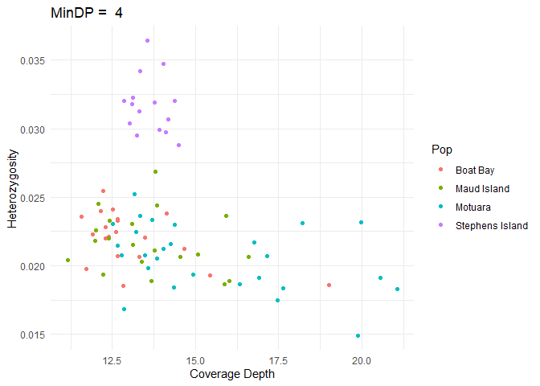
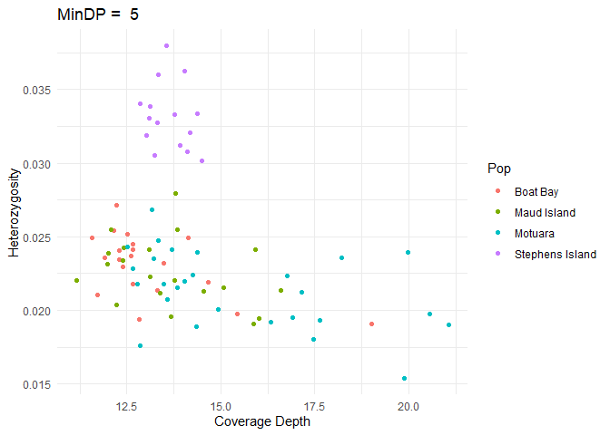
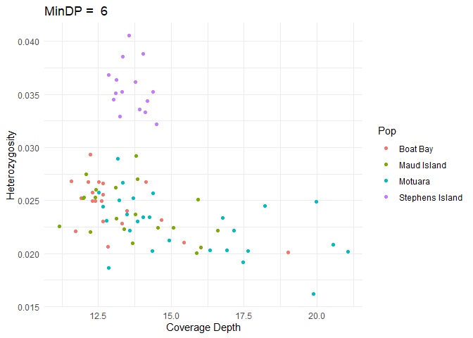

CoveragePlots
================
Hadley Muller
2025-04-01

\#Analysis Overview

I have used produced –depth & –het outputs for several .vcf dataframes
which are filtered for a –minDP of two:six. Here, I would like to
produce a series of six plots to see if there is a relationship between
coverage and heterozygosity and, when this is lost in the data.

*For my future information on how I’ve run this:*

The list (in R) is a container that can hold multiple objects (like
dataframes) in a single variable. We can access each dataframe using an
index.

Then we simply use the list to run the calculation and, placing the new
version, with prop.het back into the list, and the global environment.

Also, left_join joins the dataframes based on the common column “INDV.”

### Data Import and Setup

``` r
# Clear workspace
rm(list = ls())

# Load required Packages
library(ggplot2)
library(dplyr)
```

    ## 
    ## Attaching package: 'dplyr'

    ## The following objects are masked from 'package:stats':
    ## 
    ##     filter, lag

    ## The following objects are masked from 'package:base':
    ## 
    ##     intersect, setdiff, setequal, union

``` r
# Load data
het_DP2 <- read.table("het_Depth2.het", header = TRUE)
depth_DP2 <- read.table("depth2.idepth", header = TRUE)

het_DP3 <- read.table("het_Depth3.het", header = TRUE)
depth_DP3 <- read.table("depth3.idepth", header = TRUE)

het_DP4 <- read.table("het_Depth4.het", header = TRUE)
depth_DP4 <- read.table("depth4.idepth", header = TRUE)

het_DP5 <- read.table("het_Depth5.het", header = TRUE)
depth_DP5 <- read.table("depth5.idepth", header = TRUE)

het_DP6 <- read.table("het_Depth6.het", header = TRUE)
depth_DP6 <- read.table("depth6.idepth", header = TRUE)

#Add Population information to the dataframe
het_data_list <- list(het_DP2, het_DP3, het_DP4, het_DP5, het_DP6)
names(het_data_list) <- c("het_DP2", "het_DP3", "het_DP4", "het_DP5", "het_DP6")

for (i in 1:length(het_data_list)) {
 df <- het_data_list[[i]]
 
 df <- df %>%
  mutate(Pop = case_when(
    grepl("^B", INDV) ~ "Boat Bay",   
    grepl("^T", INDV) ~ "Stephens Island",    
    grepl("^M_", INDV) ~ "Maud Island",
    grepl("^MT", INDV) ~ "Motuara",   
    grepl("^G", INDV) ~ "Maud Island"
    ))

   het_data_list[[i]] <- df
   assign(names(het_data_list)[i], df)
}

# Calculate the proportion of heterozygotes, using a for loop
for (i in 1:length(het_data_list)) {
    df <- het_data_list[[i]]
    df$Prop.Het <- (df$N_SITES - df$O.HOM.) / df$N_SITES
    
    het_data_list[[i]] <- df
    assign(names(het_data_list)[i], df)
}

#Merge our dataframes
dep_data_list <- list(depth_DP2, depth_DP3, depth_DP4, depth_DP5, depth_DP6)
names(dep_data_list) <- c("depth_DP2", "depth_DP3", "depth_DP4", "depth_DP5", "depth_DP6")


for (i in 1:length(het_data_list)) {
  
  df <- het_data_list[[i]]
  dep <- dep_data_list[[i]] %>% select(INDV, MEAN_DEPTH)
  df <- df %>% left_join(dep, by = 'INDV')
  
  het_data_list[[i]] <- df
  assign(names(het_data_list)[i], df)
}
```

\#Create Scatterplot

``` r
for (i in 1:length(het_data_list)) {

df <- het_data_list[[i]]

titles <- paste("MinDP = ",i + 1)
  
plot <- ggplot(df, aes(x = MEAN_DEPTH, y = Prop.Het, col = Pop)) +
  geom_point() +  
  theme_minimal() +  
  labs(x = "Coverage Depth", y = "Heterozygosity", title = titles) 

print(plot)
  
}
```

<!-- --><!-- --><!-- --><!-- --><!-- -->
