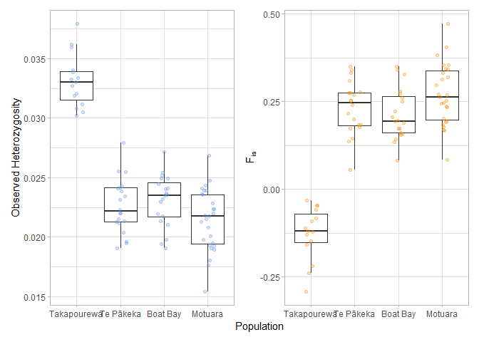

Genetic Diversity and Inbreeding
================
Hadley Muller
2025-04-30

# Genetic Diversity and Inbreeding

I’d like to compare heterozygosity and, inbreeding across the four
populations I’ve sequenced.

## Data Import and Setup

``` r
# Clear workspace
rm(list = ls())

# Load required Packages
library(ggplot2)
library(dplyr)
```

    ## 
    ## Attaching package: 'dplyr'

    ## The following objects are masked from 'package:stats':
    ## 
    ##     filter, lag

    ## The following objects are masked from 'package:base':
    ## 
    ##     intersect, setdiff, setequal, union

``` r
library(patchwork)

# Load data
Het <- read.table("Heterozygosity.het", header = TRUE)

#Add sample information to the dataframe
Het <- Het %>%
  mutate(Pop = case_when(
    grepl("^B", INDV) ~ "Boat Bay",   
    grepl("^T", INDV) ~ "Takapourewa",    
    grepl("^M_", INDV) ~ "Te Pākeka",
    grepl("^MT", INDV) ~ "Motuara",   
    grepl("^G", INDV) ~ "Te Pākeka"
    ))

#Calculate the proportion of heterozygotes
Het$Prop.Het <- (Het$N_SITES - Het$O.HOM.) / Het$N_SITES

#Set factor levels
Het$Pop <- factor(Het$Pop, levels = c("Takapourewa", "Te Pākeka", "Boat Bay", "Motuara" ))
```

## Simple ANOVA

First for heterozygosity.

``` r
m1 <- aov(Prop.Het ~ Pop, data = Het)
summary(m1)
```

    ##             Df    Sum Sq   Mean Sq F value Pr(>F)    
    ## Pop          3 0.0014831 0.0004944   89.35 <2e-16 ***
    ## Residuals   78 0.0004316 0.0000055                   
    ## ---
    ## Signif. codes:  0 '***' 0.001 '**' 0.01 '*' 0.05 '.' 0.1 ' ' 1

``` r
TukeyHSD(m1)
```

    ##   Tukey multiple comparisons of means
    ##     95% family-wise confidence level
    ## 
    ## Fit: aov(formula = Prop.Het ~ Pop, data = Het)
    ## 
    ## $Pop
    ##                                diff          lwr           upr     p adj
    ## Te Pākeka-Takapourewa -0.0105450345 -0.012654301 -0.0084357685 0.0000000
    ## Boat Bay-Takapourewa  -0.0100685285 -0.012177795 -0.0079592625 0.0000000
    ## Motuara-Takapourewa   -0.0117123761 -0.013701011 -0.0097237410 0.0000000
    ## Boat Bay-Te Pākeka     0.0004765059 -0.001476295  0.0024293068 0.9185007
    ## Motuara-Te Pākeka     -0.0011673416 -0.002989181  0.0006544975 0.3399711
    ## Motuara-Boat Bay      -0.0016438475 -0.003465687  0.0001779915 0.0917234

And for inbreeding

``` r
m2 <- aov(F ~ Pop, data = Het)
summary(m2)
```

    ##             Df Sum Sq Mean Sq F value Pr(>F)    
    ## Pop          3 1.7041  0.5680   90.68 <2e-16 ***
    ## Residuals   78 0.4886  0.0063                   
    ## ---
    ## Signif. codes:  0 '***' 0.001 '**' 0.01 '*' 0.05 '.' 0.1 ' ' 1

``` r
TukeyHSD(m2)
```

    ##   Tukey multiple comparisons of means
    ##     95% family-wise confidence level
    ## 
    ## Fit: aov(formula = F ~ Pop, data = Het)
    ## 
    ## $Pop
    ##                              diff          lwr        upr     p adj
    ## Te Pākeka-Takapourewa  0.35860533  0.287634211 0.42957646 0.0000000
    ## Boat Bay-Takapourewa   0.33987533  0.268904211 0.41084646 0.0000000
    ## Motuara-Takapourewa    0.39692511  0.330012895 0.46383733 0.0000000
    ## Boat Bay-Te Pākeka    -0.01873000 -0.084436492 0.04697649 0.8770989
    ## Motuara-Te Pākeka      0.03831978 -0.022980202 0.09961976 0.3619248
    ## Motuara-Boat Bay       0.05704978 -0.004250202 0.11834976 0.0773821

## Descriptive Statistics

``` r
median(Het$Prop.Het)
```

    ## [1] 0.02344451

``` r
median(Het$F)
```

    ## [1] 0.201185

## Create Jitterplots

``` r
#Total Sites
het <- ggplot(Het, aes(x = Pop, y = Prop.Het)) +
  geom_boxplot(outlier.shape = NA) +
  geom_jitter(width = 0.15, colour = "cornflowerblue", alpha = 0.3) +
  theme_light() +
  labs(y= "Observed Heterozygosity", x = "Population")


#Inbreeding F(is)
Inbreeding <- ggplot(Het, aes(x = Pop, y = F)) +
  geom_boxplot(outlier.shape = NA) +
  geom_jitter(width = 0.15, colour = "darkorange", alpha = 0.3) +
  theme_light() +
  ylab(expression("F"[is])) +
  xlab("Population")

Together <- (plots = wrap_plots(het,Inbreeding)) +
  plot_layout(axis_titles = "collect")
```

``` r
Together
```

<!-- -->

``` r
ggsave(filename="together.png", plot = Together, dpi = 300, width = 9 )
```

    ## Saving 9 x 5 in image
