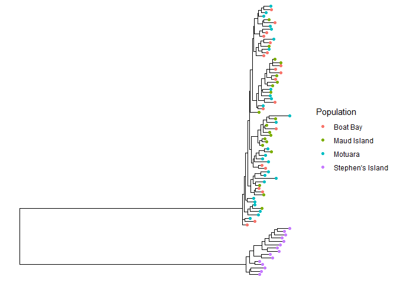
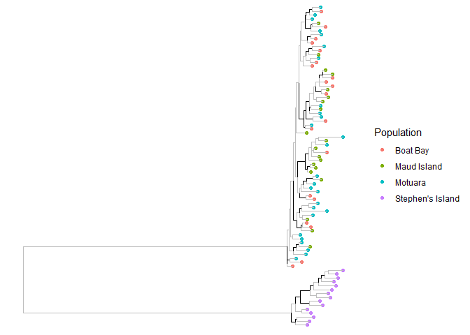

Hamilton.Tree
================
Hadley Muller
2025-04-16

# Analysis Overview

Righto, I’ve now done my maximum-likelihood phylogenetic analysis using
IQTREE2. I will visualise this using the package ‘ggtree’ loosely
following [this
tutorial](https://arftrhmn.net/creating-a-publication-quality-phylogeny-using-ggtree/).

### Data Import and Setup

``` r
# Clear workspace
rm(list = ls())

#Load required packages

# install.packages("phangorn")
# install.packages("BiocManager")
# BiocManager::install("ggtree")
# BiocManager::install("treeio")

library(phangorn)
```

    ## Warning: package 'phangorn' was built under R version 4.4.3

    ## Loading required package: ape

    ## Warning: package 'ape' was built under R version 4.4.3

``` r
library(ggtree)
```

    ## ggtree v3.14.0 Learn more at https://yulab-smu.top/contribution-tree-data/
    ## 
    ## Please cite:
    ## 
    ## Guangchuang Yu, Tommy Tsan-Yuk Lam, Huachen Zhu, Yi Guan. Two methods
    ## for mapping and visualizing associated data on phylogeny using ggtree.
    ## Molecular Biology and Evolution. 2018, 35(12):3041-3043.
    ## doi:10.1093/molbev/msy194

    ## 
    ## Attaching package: 'ggtree'

    ## The following object is masked from 'package:ape':
    ## 
    ##     rotate

``` r
library(treeio)
```

    ## treeio v1.30.0 Learn more at https://yulab-smu.top/contribution-tree-data/
    ## 
    ## Please cite:
    ## 
    ## LG Wang, TTY Lam, S Xu, Z Dai, L Zhou, T Feng, P Guo, CW Dunn, BR
    ## Jones, T Bradley, H Zhu, Y Guan, Y Jiang, G Yu. treeio: an R package
    ## for phylogenetic tree input and output with richly annotated and
    ## associated data. Molecular Biology and Evolution. 2020, 37(2):599-603.
    ## doi: 10.1093/molbev/msz240

``` r
library(ggnewscale)
```

    ## Warning: package 'ggnewscale' was built under R version 4.4.3

``` r
# Load data
Tree <- read.iqtree('Final.FrogTree.treefile')
meta <- read.csv('meta.csv')

# Midpoint root the phylo *inside* the tree data object, keeping other metadata.
Tree@phylo <- midpoint(Tree@phylo)
```

## Visualisations

``` r
Tree1 <- ggtree(Tree) %<+% meta + 
  geom_tippoint(aes(colour = Population))

Tree1
```

<!-- -->

### Bootstrap Support

IQTree2 comes with bootstrap support in both SH_aLRT and UFBoot values.
In order to annotate or filter our tree, we want to know which nodes are
supported by both values by adding a new column to our tree data.

``` r
# Add bootstrap support
Tree1$data$bootstrap <- '0'

Tree1$data[which(Tree1$data$SH_aLRT >= 70 & Tree1$data$UFboot >= 70),]$bootstrap <- '1'

Tree1 <- Tree1 + new_scale_color() +
  geom_tree(aes(color=bootstrap == '1')) +
  scale_colour_manual(name = 'Bootstrap', values = setNames( c('black', 'grey'), c(T,F)), guide = "none")

Tree1
```

<!-- -->
