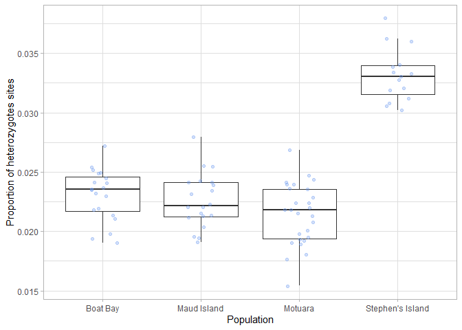
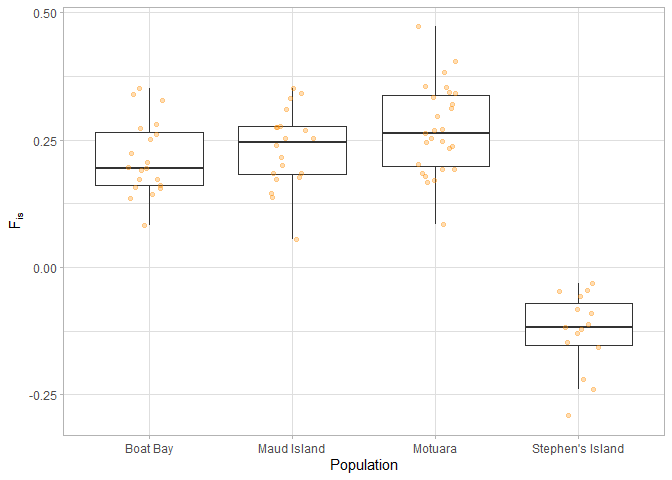

Jitter Plots
================
Hadley Muller
2025-04-30

# Jitter Plots

I’d like to compare heterozygosity and, inbreeding across the four
populations I’ve sequenced.

### Data Import and Setup

``` r
# Clear workspace
rm(list = ls())

# Load required Packages
library(ggplot2)
```

    ## Warning: package 'ggplot2' was built under R version 4.4.3

``` r
library(dplyr)
```

    ## 
    ## Attaching package: 'dplyr'

    ## The following objects are masked from 'package:stats':
    ## 
    ##     filter, lag

    ## The following objects are masked from 'package:base':
    ## 
    ##     intersect, setdiff, setequal, union

``` r
library(patchwork)
```

    ## Warning: package 'patchwork' was built under R version 4.4.3

``` r
# Load data
Het <- read.table("Heterozygosity.het", header = TRUE)

#Add sample information to the dataframe
Het <- Het %>%
  mutate(Pop = case_when(
    grepl("^B", INDV) ~ "Boat Bay",   
    grepl("^T", INDV) ~ "Stephen's Island",    
    grepl("^M_", INDV) ~ "Maud Island",
    grepl("^MT", INDV) ~ "Motuara",   
    grepl("^G", INDV) ~ "Maud Island"
    ))

#Calculate the proportion of heterozygotes
Het$Prop.Het <- (Het$N_SITES - Het$O.HOM.) / Het$N_SITES
```

\#Create Jitterplots

``` r
#Total Sites
ggplot(Het, aes(x = Pop, y = Prop.Het)) +
  geom_boxplot(outlier.shape = NA) +
  geom_jitter(width = 0.15, colour = "cornflowerblue", alpha = 0.3) +
  theme_light() +
  labs(y= "Proportion of heterozygotes sites", x = "Population")
```

<!-- -->

``` r
#Inbreeding F(is)
ggplot(Het, aes(x = Pop, y = F)) +
  geom_boxplot(outlier.shape = NA) +
  geom_jitter(width = 0.15, colour = "darkorange", alpha = 0.3) +
  theme_light() +
  ylab(expression("F"[is])) +
  xlab("Population")
```

<!-- -->
