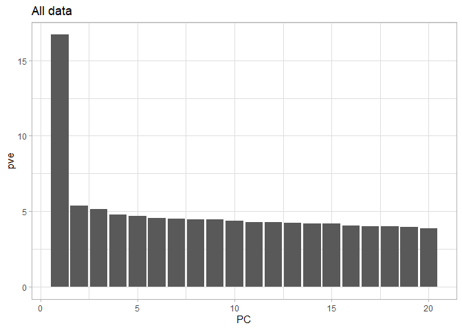
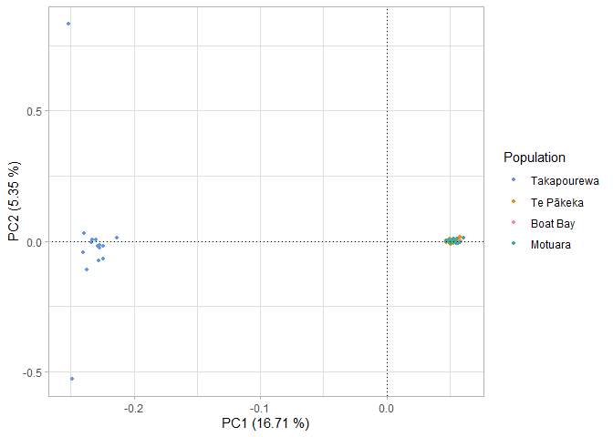
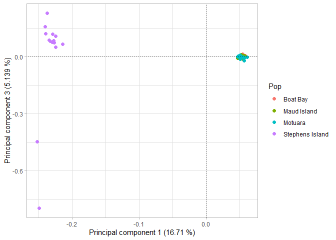
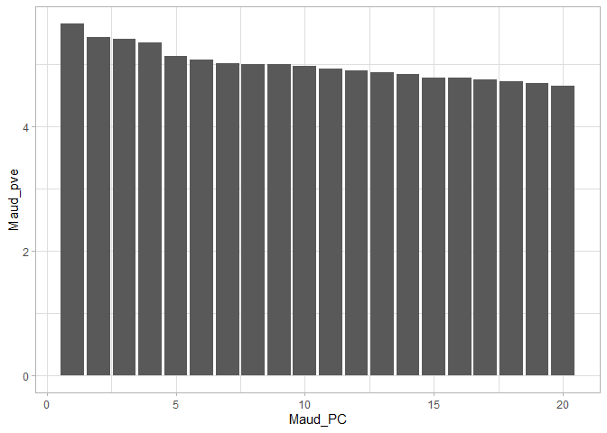
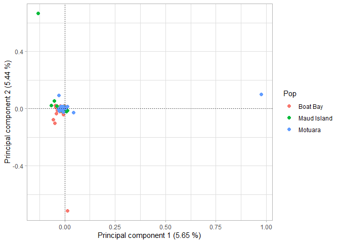

PCA
================
Hadley Muller
2025-04-16

# Data Visualisation in R

### Data Import and Setup

``` r
# Clear workspace
rm(list = ls())

#Load required packages
library(ggplot2)
```

    ## Warning: package 'ggplot2' was built under R version 4.4.3

``` r
library(ggrepel)
```

    ## Warning: package 'ggrepel' was built under R version 4.4.3

``` r
library(dplyr)
```

    ## 
    ## Attaching package: 'dplyr'

    ## The following objects are masked from 'package:stats':
    ## 
    ##     filter, lag

    ## The following objects are masked from 'package:base':
    ## 
    ##     intersect, setdiff, setequal, union

``` r
# Load eigenvectors and eigenvalues
eigenvec <- read.delim("PCA_Ham.eigenvec", header = FALSE, sep = " ")
eigenval <- read.delim("PCA_Ham.eigenval", header = FALSE)

Maud_eigenvec <- read.delim("PCA_Maud.eigenvec", header = FALSE, sep = " ")
Maud_eigenval <- read.delim("PCA_Maud.eigenval", header = FALSE)
```

I’ll tidy this data set, PLINK’s output aren’t informative and I need to
add population information.

``` r
#remove extra ID column
eigenvec <- eigenvec[,-1]
Maud_eigenvec <- Maud_eigenvec[,-1]

#set names
names(eigenvec)[1] <- "INDV"
names(eigenvec)[2:ncol(eigenvec)] <- paste0("PC", 1:(ncol(eigenvec)-1))

names(Maud_eigenvec)[1] <- "INDV"
names(Maud_eigenvec)[2:ncol(Maud_eigenvec)] <- paste0("Maud_PC", 1:(ncol(Maud_eigenvec)-1))

#Provide population information
eigenvec <- eigenvec %>%
  mutate(Pop = case_when(
    grepl("^B", INDV) ~ "Boat Bay",   
    grepl("^T", INDV) ~ "Stephens Island",    
    grepl("^M_", INDV) ~ "Maud Island",
    grepl("^MT", INDV) ~ "Motuara",   
    grepl("^G", INDV) ~ "Maud Island"
    ))

Maud_eigenvec <- Maud_eigenvec %>%
  mutate(Pop = case_when(
    grepl("^B", INDV) ~ "Boat Bay",   
    grepl("^T", INDV) ~ "Stephens Island",    
    grepl("^M_", INDV) ~ "Maud Island",
    grepl("^MT", INDV) ~ "Motuara",   
    grepl("^G", INDV) ~ "Maud Island"
    ))
```

\#Visualise our Data

\###EigenValues

``` r
#Calculate the percentage variance explained
PVE <- data.frame(PC = 1:20, pve = eigenval$V1/sum(eigenval$V1)*100)

ggplot(PVE, aes(x = PC, y = pve)) + 
  geom_bar(stat="identity") +
  theme_light()
```

<!-- -->

\###Plots

``` r
ggplot(eigenvec, aes(x = PC1, y = PC2, colour = Pop)) +
  geom_point(size = 2) +
  geom_hline(yintercept = 0, linetype="dotted") +
  geom_vline(xintercept = 0, linetype="dotted") +
  labs(
    y = paste0("Principal component 2 (",round(PVE$pve[2], 2)," %)"), 
    x = paste0("Principal component 1 (",round(PVE$pve[1], 2)," %)")) + 
  theme_light()
```

<!-- -->

``` r
ggplot(eigenvec, aes(x = PC1, y = PC3, colour = Pop)) +
  geom_point(size = 2) +
  geom_hline(yintercept = 0, linetype="dotted") +
  geom_vline(xintercept = 0, linetype="dotted") +
  labs(
    y = paste0("Principal component 3 (",round(PVE$pve[3], 3)," %)"), 
    x = paste0("Principal component 1 (",round(PVE$pve[1], 2)," %)")) + 
  theme_light()
```

<!-- -->

### Translocation data only

``` r
Maud_PVE <- data.frame(Maud_PC = 1:20, Maud_pve = Maud_eigenval$V1/sum(Maud_eigenval$V1)*100)

ggplot(Maud_PVE, aes(x = Maud_PC, y = Maud_pve)) +
  geom_bar(stat = "identity") +
  theme_light()
```

<!-- -->

``` r
ggplot(Maud_eigenvec, aes(x = Maud_PC1, y = Maud_PC2, colour = Pop)) +
  geom_point(size = 2) +
  geom_hline(yintercept = 0, linetype="dotted") +
  geom_vline(xintercept = 0, linetype="dotted") +
  labs(
    y = paste0("Principal component 2 (",round(Maud_PVE$Maud_pve[2], 2)," %)"), 
    x = paste0("Principal component 1 (",round(Maud_PVE$Maud_pve[1], 2)," %)")) + 
  theme_light()
```

<!-- -->
