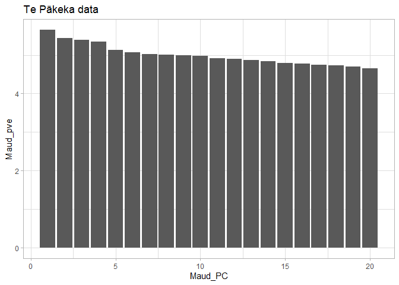

PCA
================
Hadley Muller
2025-04-16

# PCA: data visualisation in R

PCA plots will be included alongside a phylogeny of these same data. I
will create two plots for publication:

- all my data
- Te Pākeka + translocated sites alongside

I ran these separately in PLINK. Loosely following this [useful
tutorial](https://speciationgenomics.github.io/pca/) on cichlids.

## Data Import and Setup

``` r
# Clear workspace
rm(list = ls())

#Load packages
library(ggplot2)
```

    ## Warning: package 'ggplot2' was built under R version 4.5.3

``` r
library(ggrepel)
library(dplyr)
```

    ## Warning: package 'dplyr' was built under R version 4.5.3

    ## 
    ## Attaching package: 'dplyr'

    ## The following objects are masked from 'package:stats':
    ## 
    ##     filter, lag

    ## The following objects are masked from 'package:base':
    ## 
    ##     intersect, setdiff, setequal, union

``` r
# Load eigenvectors and eigenvalues
eigenvec <- read.delim("PCA_Ham.eigenvec", header = FALSE, sep = " ")
eigenval <- read.delim("PCA_Ham.eigenval", header = FALSE)

Maud_eigenvec <- read.delim("PCA_Maud.eigenvec", header = FALSE, sep = " ")
Maud_eigenval <- read.delim("PCA_Maud.eigenval", header = FALSE)
```

I’ll tidy the data set. PLINK’s output aren’t informative for
visualization out the box; I need to add population information.

``` r
# remove extra ID column
eigenvec <- eigenvec[,-1]
Maud_eigenvec <- Maud_eigenvec[,-1]

# set names
names(eigenvec)[1] <- "INDV"
names(eigenvec)[2:ncol(eigenvec)] <- paste0("PC", 1:(ncol(eigenvec)-1))

names(Maud_eigenvec)[1] <- "INDV"
names(Maud_eigenvec)[2:ncol(Maud_eigenvec)] <- paste0("Maud_PC", 1:(ncol(Maud_eigenvec)-1))

# Provide population information
eigenvec <- eigenvec %>%
  mutate(Population = case_when(
    grepl("^B", INDV) ~ "Boat Bay",   
    grepl("^T", INDV) ~ "Takapourewa",    
    grepl("^M_", INDV) ~ "Te Pākeka",
    grepl("^MT", INDV) ~ "Motuara",   
    grepl("^G", INDV) ~ "Te Pākeka"
    ))

Maud_eigenvec <- Maud_eigenvec %>%
  mutate(Population = case_when(
    grepl("^B", INDV) ~ "Boat Bay",   
    grepl("^T", INDV) ~ "Takapourewa",    
    grepl("^M_", INDV) ~ "Te Pākeka",
    grepl("^MT", INDV) ~ "Motuara",   
    grepl("^G", INDV) ~ "Te Pākeka"
    ))

# Set factor levels, in line with phylogeny
eigenvec$Population <- factor(eigenvec$Population, levels = c("Takapourewa", "Te Pākeka", "Boat Bay", "Motuara" ))
Maud_eigenvec$Population <- factor(Maud_eigenvec$Population, levels = c("Takapourewa", "Te Pākeka", "Boat Bay", "Motuara" ))
```

## Visualise our Data

### EigenValues

The Eigenvalues ppaint a strong picture of the Takapourewa/Te Pākeka
split being almost the sole driver of meaningful variance.

``` r
#Calculate the percentage variance explained
PVE <- data.frame(PC = 1:20, pve = eigenval$V1/sum(eigenval$V1)*100)

ggplot(PVE, aes(x = PC, y = pve)) + 
  geom_bar(stat="identity") +
  theme_light() +
  ggtitle("All data")
```

<!-- -->

``` r
Maud_PVE <- data.frame(Maud_PC = 1:20, Maud_pve = Maud_eigenval$V1/sum(Maud_eigenval$V1)*100)

ggplot(Maud_PVE, aes(x = Maud_PC, y = Maud_pve)) +
  geom_bar(stat = "identity") +
  theme_light() +
  ggtitle("Te Pākeka data")
```

<!-- -->

### Plots

``` r
PCA_All <- 
  ggplot(eigenvec, aes(x = PC1, y = PC2, colour =
    Population)) +
  geom_point(size = 2, shape = 20) +
  geom_hline(yintercept = 0, linetype="dotted") +
  geom_vline(xintercept = 0, linetype="dotted") +
  labs(
    y = paste0("PC2 (",round(PVE$pve[2], 2)," %)"), 
    x = paste0("PC1 (",round(PVE$pve[1], 2)," %)")) + 
  theme_light() +
  scale_colour_manual(values = c("cornflowerblue",
    "darkorange","#F763E0", "#44AA99")) +
  theme(
    axis.title = element_text(size = 13, colour =
      "black", face = "plain"),
    axis.text  = element_text(size = 12, colour =
      "black")) +
  theme(legend.position = "none") 
  

PCA_All
```

<!-- -->

``` r
PCA_Maud <-
  ggplot(Maud_eigenvec, aes(x = Maud_PC1, y = Maud_PC2,
    colour = Population)) +
  geom_point(size = 2, shape = 20) +
  geom_hline(yintercept = 0, linetype="dotted") +
  geom_vline(xintercept = 0, linetype="dotted") +
  labs(
    y = paste0("PC2 (",round(Maud_PVE$Maud_pve[2], 2)," %)"), 
    x = paste0("PC1 (",round(Maud_PVE$Maud_pve[1], 2)," %)")) + 
  theme_light() +
  scale_colour_manual(values = c(
    "darkorange","#F763E0", "#44AA99")) +
  theme(
    axis.title = element_text(size = 13, colour =
      "black", face = "plain"),
    axis.text  = element_text(size = 12, colour =
      "black")) +
  theme(legend.position = "none") 

PCA_Maud
```

<!-- -->

### Additional Plotting

``` r
PCA_PC3 <- ggplot(eigenvec, aes(x = PC1, y = PC3, colour = Population)) +
  geom_point(size = 2) +
  geom_hline(yintercept = 0, linetype="dotted") +
  geom_vline(xintercept = 0, linetype="dotted") +
  labs(
    y = paste0("Principal component 3 (",round(PVE$pve[3], 3)," %)"), 
    x = paste0("Principal component 1 (",round(PVE$pve[1], 2)," %)")) + 
  theme_light() +
  ggtitle("All data PCA3")

PCA_PC3
```

<!-- -->
