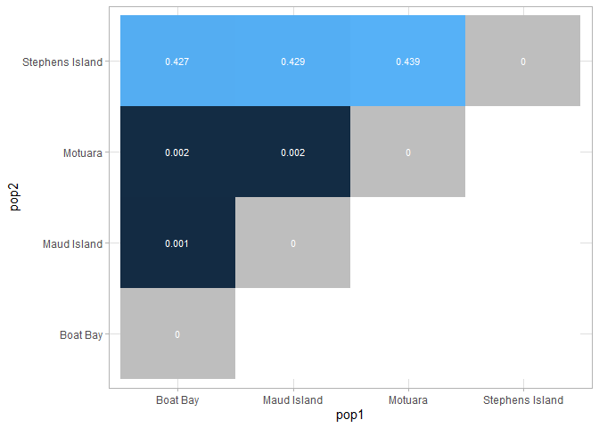

# Analysis Overview
We will calculate F<sub>st</sub> across the four populations in this analysis. Although [VCFtools](https://vcftools.github.io/documentation.html) does allow you to do this, it is inefficient and we'd have to do so manually for each pair. Instead, we we'll try to streamline this analysis in R with the package SNPRelate.

Code loosely follows tutorials [here](https://github.com/rgiannico/RpairwiseFST/tree/master?tab=readme-ov-file), also utilising the package [vignette](https://bioconductor.org/packages/release/bioc/vignettes/SNPRelate/inst/doc/SNPRelate.html#format-conversion-from-vcf-files).

## Data Import and Setup
Create a  tab separated .txt file that describes the population information, based on our popmap.txt from denovo_map.pl in Stacks.

```bash
cd /home/mulha552/uoo04306/frogs_gbs
awk '{
  if ($1 ~ /^B/)   $2 = "Boat Bay";
  else if ($1 ~ /^T/)  $2 = "Stephens Island";
  else if ($1 ~ /^M_/) $2 = "Maud Island";
  else if ($1 ~ /^MT/) $2 = "Motuara";
  else if ($1 ~ /^G/)  $2 = "Maud Island";
  print $1, $2;
}' popmap.txt > meta.txt
```
Export to R, code can be run locally on a PC.
``` r
# Clear workspace
rm(list = ls())

# Load & install required packages
#if (!require("BiocManager", quietly = TRUE))
# install.packages("BiocManager")
# BiocManager::install("SNPRelate")
library(SNPRelate)
```

    ## Loading required package: gdsfmt

    ## SNPRelate -- supported by Streaming SIMD Extensions 2 (SSE2)

``` r
library(tidyverse)
```

    ## ── Attaching core tidyverse packages ──────────────────────── tidyverse 2.0.0 ──
    ## ✔ dplyr     1.1.4     ✔ readr     2.1.5
    ## ✔ forcats   1.0.0     ✔ stringr   1.5.1
    ## ✔ ggplot2   3.5.2     ✔ tibble    3.2.1
    ## ✔ lubridate 1.9.4     ✔ tidyr     1.3.1
    ## ✔ purrr     1.0.4

    ## ── Conflicts ────────────────────────────────────────── tidyverse_conflicts() ──
    ## ✖ dplyr::filter() masks stats::filter()
    ## ✖ dplyr::lag()    masks stats::lag()
    ## ℹ Use the conflicted package (<http://conflicted.r-lib.org/>) to force all conflicts to become errors

``` r
# Set parameters & input files
vcf.infile <- "HamFrogR08maxsnps1DP5.recode.vcf"
metadata.infile <- "meta.txt"

# Parse .vcf file only run "snpgdsVCF2GDS the first time....
# snpgdsVCF2GDS(vcf.infile, "Ham.gds", method = "biallelic.only")
snpgdsSummary("Ham.gds")
```

    ## The file name: C:\Users\hadle\OneDrive\Desktop\Master's Thesis\Data Analysis\Population Genomics\Pairwise Fst\Ham.gds 
    ## The total number of samples: 82 
    ## The total number of SNPs: 21250 
    ## SNP genotypes are stored in SNP-major mode (Sample X SNP).

``` r
genofile <- snpgdsOpen("Ham.gds")
sample.id <- read.gdsn(index.gdsn(genofile, "sample.id"))

# Parse population metadata
metadata=read.table(file = metadata.infile, header = TRUE, sep = "\t")
metadata=metadata[order(factor(metadata$Samples, levels = sample.id)),] # order by sample.id

pop_code=metadata$Population
poplevels=levels(as.factor(pop_code)) # only unique levels

# Create population matrix
popmatrix= outer(X= poplevels , Y= poplevels, 
           FUN = function(x,y){
             paste(x,y,sep = "/")})

colnames(popmatrix)=poplevels
rownames(popmatrix)=poplevels

as.data.frame(popmatrix)
```

    ##                                 Boat Bay                 Maud Island
    ## Boat Bay               Boat Bay/Boat Bay        Boat Bay/Maud Island
    ## Maud Island         Maud Island/Boat Bay     Maud Island/Maud Island
    ## Motuara                 Motuara/Boat Bay         Motuara/Maud Island
    ## Stephens Island Stephens Island/Boat Bay Stephens Island/Maud Island
    ##                                 Motuara                 Stephens Island
    ## Boat Bay               Boat Bay/Motuara        Boat Bay/Stephens Island
    ## Maud Island         Maud Island/Motuara     Maud Island/Stephens Island
    ## Motuara                 Motuara/Motuara         Motuara/Stephens Island
    ## Stephens Island Stephens Island/Motuara Stephens Island/Stephens Island

### Calculate Pairwise F<sub>st</sub>

``` r
# We extract & separate each population pair & save this as a vector "poplem"
for(x in poplevels) { 
  for(y in poplevels) { 
    popelem= unlist(strsplit(popmatrix[x,y],"/"))
    
# Select relevant samples for this this population pair
    flag<- pop_code %in% c(popelem[1],popelem[2])
    samp.sel<- sample.id[flag]
    pop.sel<- pop_code[flag]
# Calculate weighted F<sub>st</sub>, with caveat F<sub>st</sub> is zero on the diagonal    
    if (popelem[1]==popelem[2]){result="0"}else{
      result = snpgdsFst(genofile, sample.id=samp.sel, population=as.factor(pop.sel), 
                         autosome.only=FALSE, method="W&C84")
         result = result$Fst # or $MeanFst
    }
# Assign result to the matrix
    popmatrix[x,y]=as.character(result)
  }
}
```

    ## Fst estimation on genotypes:
    ## Excluding 10,524 SNPs (monomorphic: TRUE, MAF: NaN, missing rate: NaN)
    ##     # of samples: 40
    ##     # of SNPs: 10,726
    ## Method: Weir & Cockerham, 1984
    ## # of Populations: 2
    ##     Boat Bay (20), Maud Island (20)
    ## Fst estimation on genotypes:
    ## Excluding 9,241 SNPs (monomorphic: TRUE, MAF: NaN, missing rate: NaN)
    ##     # of samples: 47
    ##     # of SNPs: 12,009
    ## Method: Weir & Cockerham, 1984
    ## # of Populations: 2
    ##     Boat Bay (20), Motuara (27)
    ## Fst estimation on genotypes:
    ## Excluding 10,270 SNPs (monomorphic: TRUE, MAF: NaN, missing rate: NaN)
    ##     # of samples: 35
    ##     # of SNPs: 10,980
    ## Method: Weir & Cockerham, 1984
    ## # of Populations: 2
    ##     Boat Bay (20), Stephens Island (15)
    ## Fst estimation on genotypes:
    ## Excluding 10,524 SNPs (monomorphic: TRUE, MAF: NaN, missing rate: NaN)
    ##     # of samples: 40
    ##     # of SNPs: 10,726
    ## Method: Weir & Cockerham, 1984
    ## # of Populations: 2
    ##     Boat Bay (20), Maud Island (20)
    ## Fst estimation on genotypes:
    ## Excluding 9,294 SNPs (monomorphic: TRUE, MAF: NaN, missing rate: NaN)
    ##     # of samples: 47
    ##     # of SNPs: 11,956
    ## Method: Weir & Cockerham, 1984
    ## # of Populations: 2
    ##     Maud Island (20), Motuara (27)
    ## Fst estimation on genotypes:
    ## Excluding 10,408 SNPs (monomorphic: TRUE, MAF: NaN, missing rate: NaN)
    ##     # of samples: 35
    ##     # of SNPs: 10,842
    ## Method: Weir & Cockerham, 1984
    ## # of Populations: 2
    ##     Maud Island (20), Stephens Island (15)
    ## Fst estimation on genotypes:
    ## Excluding 9,241 SNPs (monomorphic: TRUE, MAF: NaN, missing rate: NaN)
    ##     # of samples: 47
    ##     # of SNPs: 12,009
    ## Method: Weir & Cockerham, 1984
    ## # of Populations: 2
    ##     Boat Bay (20), Motuara (27)
    ## Fst estimation on genotypes:
    ## Excluding 9,294 SNPs (monomorphic: TRUE, MAF: NaN, missing rate: NaN)
    ##     # of samples: 47
    ##     # of SNPs: 11,956
    ## Method: Weir & Cockerham, 1984
    ## # of Populations: 2
    ##     Maud Island (20), Motuara (27)
    ## Fst estimation on genotypes:
    ## Excluding 9,053 SNPs (monomorphic: TRUE, MAF: NaN, missing rate: NaN)
    ##     # of samples: 42
    ##     # of SNPs: 12,197
    ## Method: Weir & Cockerham, 1984
    ## # of Populations: 2
    ##     Motuara (27), Stephens Island (15)
    ## Fst estimation on genotypes:
    ## Excluding 10,270 SNPs (monomorphic: TRUE, MAF: NaN, missing rate: NaN)
    ##     # of samples: 35
    ##     # of SNPs: 10,980
    ## Method: Weir & Cockerham, 1984
    ## # of Populations: 2
    ##     Boat Bay (20), Stephens Island (15)
    ## Fst estimation on genotypes:
    ## Excluding 10,408 SNPs (monomorphic: TRUE, MAF: NaN, missing rate: NaN)
    ##     # of samples: 35
    ##     # of SNPs: 10,842
    ## Method: Weir & Cockerham, 1984
    ## # of Populations: 2
    ##     Maud Island (20), Stephens Island (15)
    ## Fst estimation on genotypes:
    ## Excluding 9,053 SNPs (monomorphic: TRUE, MAF: NaN, missing rate: NaN)
    ##     # of samples: 42
    ##     # of SNPs: 12,197
    ## Method: Weir & Cockerham, 1984
    ## # of Populations: 2
    ##     Motuara (27), Stephens Island (15)

``` r
# Make cell values numeric
popmatrix=data.frame(apply(popmatrix, 2, function(x) as.numeric(as.character(x))))
row.names(popmatrix)=poplevels
```

### Plotting with ggplot

``` r
# Remove the upper triangle 
popmatrix[lower.tri(popmatrix)] <- NA

# Convert to long format for ggplot
matrix_long <- popmatrix %>%
  as.data.frame() %>%
  rownames_to_column("pop1") %>%
  pivot_longer(-pop1, names_to = "pop2", values_to = "fst") %>%
  mutate(is_diag = pop1 == pop2)

# Looks like it modified "pop2," we'll change this back so it algins with poplevels
matrix_long <- matrix_long %>%
  mutate(pop2 = case_when(
    grepl("^B", pop2) ~ "Boat Bay",   
    grepl("^S", pop2) ~ "Stephens Island",    
    grepl("^Ma", pop2) ~ "Maud Island",
    grepl("^Mo", pop2) ~ "Motuara"  
    ))

# Create factor orders
matrix_long$pop1 <- factor(matrix_long$pop1, levels = poplevels)
matrix_long$pop2 <- factor(matrix_long$pop2, levels = poplevels)

# Plot heatmap 
fst_heat <- ggplot(matrix_long, aes(pop1, pop2, fill = fst)) +
  geom_tile(aes(fill = fst)) +
  geom_tile(data = filter(matrix_long, fst == 0), fill = "gray", alpha = 1) +
  geom_text(aes(label = round(fst, 3)), size = 3, colour = "white") +
  scale_fill_continuous(na.value = "white") +
  theme_light() +
  theme(legend.position = "none")

fst_heat
```

    ## Warning: Removed 6 rows containing missing values or values outside the scale range
    ## (`geom_text()`).

<!-- -->
