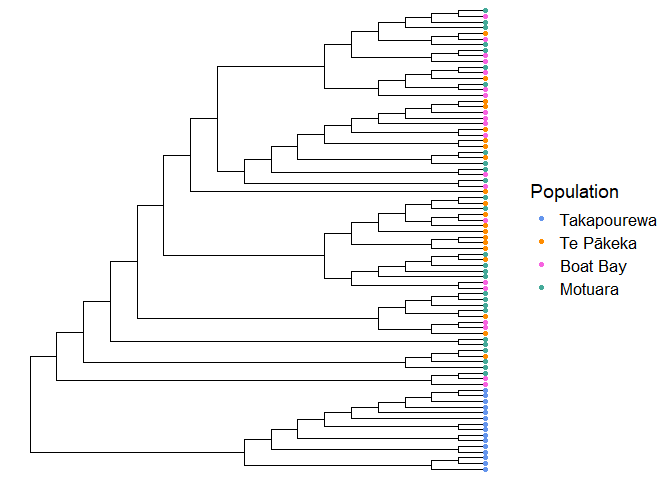
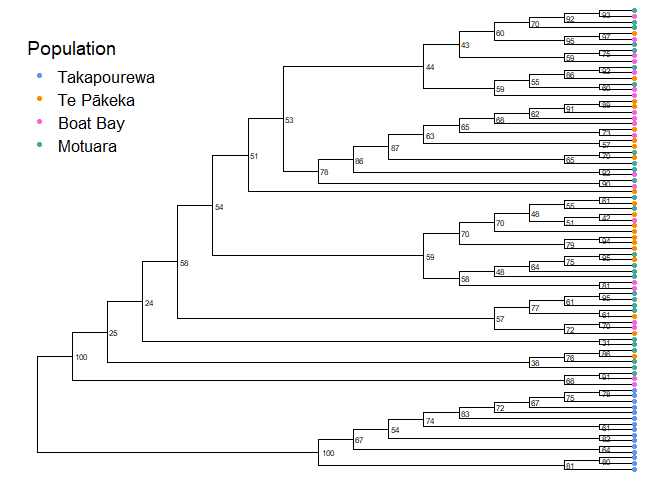

Phylogenetics
================
Hadley Muller
2025-04-16

# Phylogenetic Tree

I ran a maximum-likelihood phylogenetic analysis using IQTREE2. Using
the package ‘ggtree,’ I will loosely follow [this
tutorial](https://arftrhmn.net/creating-a-publication-quality-phylogeny-using-ggtree/)
to produce a midpoint rooted visualisation.

## Data Import and Setup

Install BiocManager related package if required.

``` r
install.packages("BiocManager")
BiocManager::install("ggtree")
BiocManager::install("treeio")
```

``` r
# Clear workspace
rm(list = ls())

# Load Packages
library(ggtree)
```

    ## ggtree v3.16.0 Learn more at https://yulab-smu.top/contribution-tree-data/
    ## 
    ## Please cite:
    ## 
    ## Guangchuang Yu.  Data Integration, Manipulation and Visualization of
    ## Phylogenetic Trees (1st edition). Chapman and Hall/CRC. 2022,
    ## doi:10.1201/9781003279242, ISBN: 9781032233574

``` r
library(phangorn)
```

    ## Loading required package: ape

    ## 
    ## Attaching package: 'ape'

    ## The following object is masked from 'package:ggtree':
    ## 
    ##     rotate

``` r
library(treeio)
```

    ## treeio v1.32.0 Learn more at https://yulab-smu.top/contribution-tree-data/
    ## 
    ## Please cite:
    ## 
    ## LG Wang, TTY Lam, S Xu, Z Dai, L Zhou, T Feng, P Guo, CW Dunn, BR
    ## Jones, T Bradley, H Zhu, Y Guan, Y Jiang, G Yu. treeio: an R package
    ## for phylogenetic tree input and output with richly annotated and
    ## associated data. Molecular Biology and Evolution. 2020, 37(2):599-603.
    ## doi: 10.1093/molbev/msz240

``` r
library(patchwork)
```

    ## Warning: package 'patchwork' was built under R version 4.5.3

``` r
library(ggplot2)
```

    ## Warning: package 'ggplot2' was built under R version 4.5.3

``` r
# Load data
Tree <- read.iqtree('Final.FrogTree.treefile')
meta <- read.csv('meta.csv', fileEncoding = "UTF-8")

# Set factor levels
meta$Population <- factor(meta$Population, levels = c("Takapourewa", "Te Pākeka", "Boat Bay", "Motuara" ))

# Midpoint root the the tree data object, preserving node data
Tree@phylo$node.label <- as.character(Tree@data$UFboot)

# Midpoint root
Tree@phylo <- midpoint(Tree@phylo)
```

## Visualisations

First a basic tree, coloured by population. Using *branch.length =
‘none’* allows a cladogram without branch length scaling; useful to fit
bootstrap values on the tree later.

``` r
Tree1 <- 
  ggtree(Tree, branch.length = "none") %<+% meta +
  geom_tippoint(aes(colour = Population)) +
  scale_colour_manual(values = c("cornflowerblue", "darkorange","#F763E0", "#44AA99")) +
  theme(legend.text = element_text(size=13)) +
  theme(legend.title = element_text(size=14))
```

    ## Warning: `aes_()` was deprecated in ggplot2 3.0.0.
    ## ℹ Please use tidy evaluation idioms with `aes()`
    ## ℹ The deprecated feature was likely used in the ggtree package.
    ##   Please report the issue at <https://github.com/YuLab-SMU/ggtree/issues>.
    ## This warning is displayed once per session.
    ## Call `lifecycle::last_lifecycle_warnings()` to see where this warning was
    ## generated.

    ## Warning in fortify(data, ...): Arguments in `...` must be used.
    ## ✖ Problematic arguments:
    ## • as.Date = as.Date
    ## • yscale_mapping = yscale_mapping
    ## • hang = hang
    ## ℹ Did you misspell an argument name?

``` r
Tree1
```

<!-- -->

### Bootstrap Support

IQTree2 provides node support with:

- SH_aLRT, a likelihood measure
- UFBoot, a more *traditional* bootstrap measure.

For the purpose of this simple tree, I will annotate with UFBoot.
However, in other cases both measures can be used to evaluate node
support.

*Extra:* I need to move the legnd to the top left for patchwork to
create an effective visualisaiton.

``` r
# Add bootstrap support
Tree_UF <- Tree1 + geom_text2(aes(subset = !isTip, label = label),size = 2,hjust = -0.3) +
  theme(
   legend.position = c(0.02, 0.95),
  legend.justification = c(0, 1) # anchor top left
  )

Tree_UF
```

<!-- -->

### Export final plot

Plotting alongside PCA plots of the same data for final publication;
using patchwork.

``` r
Plot_Manuscript <- 
  (Tree_UF_2 / (PCA_All | PCA_Maud)) +
  plot_layout(heights  = c(2, 1), 
    axis_titles = "collect") +
  plot_annotation(tag_levels = "A")

Plot_Manuscript

ggsave(filename="Figure2.pdf", plot = Plot_Manuscript, dpi = 300, width = 11, height = 13)
```
