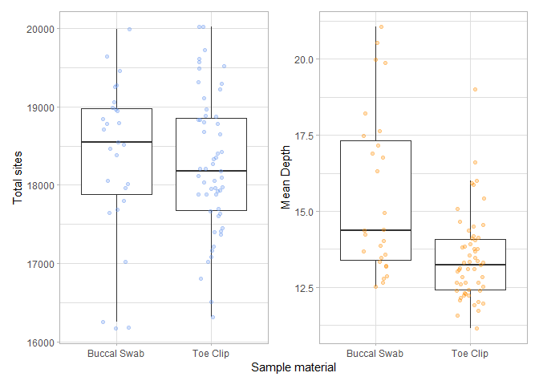
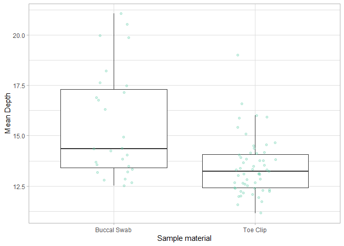
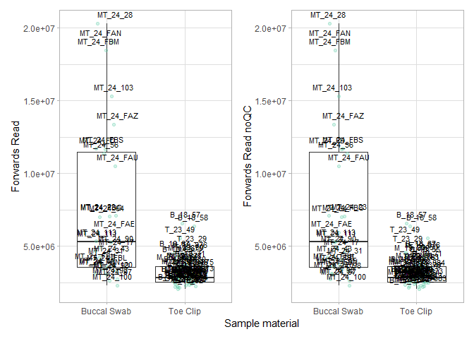

# Sample comparison

I have completed SNP calling for the Hamilton’s Frog GBS data, which contains both toe clips and, buccal swabs; because this is the first time anyone has utilised buccal swabbing on *Leiopelma*, I’d will produce jitter plots comparing total sites and individual missingness. In addition, I investigated the apparent difference in coverage depth
between these sample types. Results from these analyses were published in [the New Zealand Journal of Ecology](https://newzealandecology.org/nzje/3631)

## Data Import and Setup

``` r
# Clear workspace
rm(list = ls())

# Load required Packages
library(ggplot2)
library(dplyr)
```

    ## 
    ## Attaching package: 'dplyr'

    ## The following objects are masked from 'package:stats':
    ## 
    ##     filter, lag

    ## The following objects are masked from 'package:base':
    ## 
    ##     intersect, setdiff, setequal, union

``` r
library(patchwork)

#set seed
set.seed(7512)

# Load data
Dep <- read.table("Depth.idepth", header = TRUE)
Miss <- read.table("Missingness.imiss", header = TRUE)

#Merge data, and add sample information to the new dataframe
data <- left_join(Dep, Miss, by = "INDV") %>%
  mutate(Tissue = case_when(
    grepl("^B", INDV) ~ "Toe Clip",   
    grepl("^T", INDV) ~ "Toe Clip",    
    grepl("^M_", INDV) ~ "Toe Clip",
    grepl("^MT", INDV) ~ "Buccal Swab",   
    grepl("^G", INDV) ~ "Toe Clip"
    ))
```

## Simple t-test

``` r
#Subset data
Mtoeclip <- (data[data$Tissue == "Toe Clip", "F_MISS"])
Mswab <- (data[data$Tissue == "Buccal Swab", "F_MISS"])

Ntoeclip <- (data[data$Tissue == "Toe Clip", "N_SITES"])
Nswab <- (data[data$Tissue == "Buccal Swab", "N_SITES"])

#Welch's t-test
t.test(Mtoeclip, Mswab, var.equal=FALSE)
```

    ## 
    ##  Welch Two Sample t-test
    ## 
    ## data:  Mtoeclip and Mswab
    ## t = 0.59087, df = 49.425, p-value = 0.5573
    ## alternative hypothesis: true difference in means is not equal to 0
    ## 95 percent confidence interval:
    ##  -0.01926771  0.03532203
    ## sample estimates:
    ## mean of x mean of y 
    ## 0.1944882 0.1864610

``` r
t.test(Ntoeclip, Nswab, var.equal=FALSE)
```

    ## 
    ##  Welch Two Sample t-test
    ## 
    ## data:  Ntoeclip and Nswab
    ## t = -0.35383, df = 45.437, p-value = 0.7251
    ## alternative hypothesis: true difference in means is not equal to 0
    ## 95 percent confidence interval:
    ##  -540.6913  379.0671
    ## sample estimates:
    ## mean of x mean of y 
    ##  18266.85  18347.67

## Create Jitter plots

``` r
#Total Sites
plot1 <- ggplot(data, aes(x = Tissue, y = N_SITES)) +
  geom_boxplot(outlier.shape = NA) +
  geom_jitter(width = 0.15, colour = "cornflowerblue", alpha = 0.3) +
  theme_light() +
  labs(y= "Total Number of Sites", x = "Sample Material")

#Coverage Depth
plot2 <- ggplot(data, aes(x = Tissue, y = F_MISS)) +
  geom_boxplot(outlier.shape = NA) +
  geom_jitter(width = 0.15, colour = "darkorange", alpha = 0.3) +
  theme_light() +
  labs(y= "Proportion of Missing SNPs", x = "Sample Material")

(plots = wrap_plots(plot1,plot2)) +
  plot_layout(axis_titles = "collect")
```

<!-- -->

## Investigating Coverage Depth

``` r
Dtoeclip <- (data[data$Tissue == "Toe Clip", "MEAN_DEPTH"])
Dswab <- (data[data$Tissue == "Buccal Swab", "MEAN_DEPTH"])

t.test(Dtoeclip, Dswab, var.equal=FALSE)
```

    ## 
    ##  Welch Two Sample t-test
    ## 
    ## data:  Dtoeclip and Dswab
    ## t = -3.7698, df = 33.403, p-value = 0.000635
    ## alternative hypothesis: true difference in means is not equal to 0
    ## 95 percent confidence interval:
    ##  -3.1831964 -0.9523396
    ## sample estimates:
    ## mean of x mean of y 
    ##  13.45097  15.51874

``` r
ggplot(data, aes(x = Tissue, y = MEAN_DEPTH)) +
  geom_boxplot(outlier.shape = NA) +
  geom_jitter(width = 0.15, colour = "aquamarine3", alpha = 0.3) +
  theme_light() +
  labs(y= "Mean Depth", x = "Sample material")
```

<!-- -->

### Forwards Reads
We can see there is a significant difference between our two sample types. Before these results were published, I needed to find out whether this is because of 1) sample quality or 2) sequencing / lab error. So, I’ve counted the number of forwards reads from all our samples, with and, without quality control by Cutadapt.

``` r
# Load data, and add sample information
Counts <- list(QC = read.table("forward_counts.txt", header = FALSE), NO = read.table("forward_counts_noQC.txt", header = FALSE))
new_names <- c("count", "count_noQC")

for(i in 1:length(Counts)) {
   Counts[[i]] <- Counts[[i]] %>%
    rename(!!new_names[i] := V2)
}

countdata <- left_join(Counts$QC, Counts$NO, by = "V1") %>%
  mutate(Tissue = case_when(
    grepl("^B", V1) ~ "Toe Clip",   
    grepl("^T", V1) ~ "Toe Clip",    
    grepl("^M_", V1) ~ "Toe Clip",
    grepl("^MT", V1) ~ "Buccal Swab",   
    grepl("^G", V1) ~ "Toe Clip"
    ))
```

### Create Jitter plots

``` r
# Coverage depth
plot3 <- ggplot(countdata, aes(x = Tissue, y = count)) +
  geom_boxplot(outlier.shape = NA) +
  geom_jitter(width = 0.15, colour = "aquamarine3", alpha = 0.3) +
  geom_text(aes(label = V1), position = position_jitter(width = 0.15, height = 0), size = 3, vjust = -1) +
  theme_light() +
  labs(y= "Forwards Read", x = "Sample material")

plot4 <- ggplot(countdata, aes(x = Tissue, y = count_noQC)) +
  geom_boxplot(outlier.shape = NA) +
  geom_jitter(width = 0.15, colour = "aquamarine3", alpha = 0.3) +
  geom_text(aes(label = V1), position = position_jitter(width = 0.15, height = 0), size = 3, vjust = -1) +
  theme_light() +
  labs(y= "Forwards Read noQC", x = "Sample material")

(plots = wrap_plots(plot3,plot4)) +
  plot_layout(axis_titles = "collect")
```

<!-- -->

We can see a difference in forwards reads with *and* without quality control indicating the difference in coverage depth is not due to sample quality differences. My lab book indicates F103 & F28 were normalised during pooling in the lab which could, in part, contribute to this coverage depth effect.
