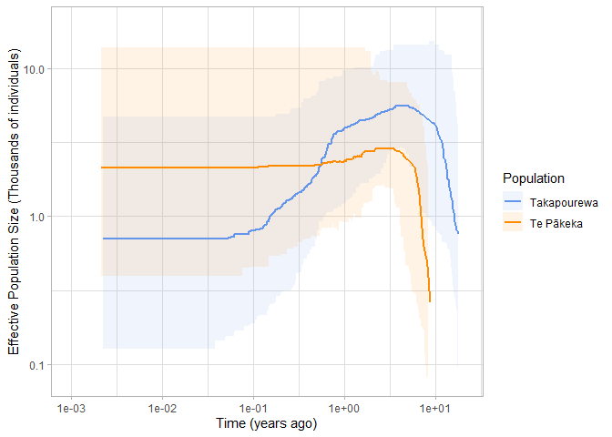

Stairway
================
Hadley Muller
2025-05-27

# Stairway Plot

### Data Import and Setup

``` r
# Clear workspace
rm(list = ls())

# Load required packages
library(ggplot2)
library(dplyr)
```

    ## 
    ## Attaching package: 'dplyr'

    ## The following objects are masked from 'package:stats':
    ## 
    ##     filter, lag

    ## The following objects are masked from 'package:base':
    ## 
    ##     intersect, setdiff, setequal, union

``` r
library(scales)
```

\###Read STWP2 results

``` r
Takapourewa <- read.table("Folded_SFS Takapourewa.rand7.summary", header = T)

Takapourewa_scaled <- Takapourewa %>% mutate(
  yearK = year / 1000,
    Ne_medianK = Ne_median / 1000,
    Ne_2.5.K = Ne_2.5. / 1000,
    Ne_97.5.K  = Ne_97.5. / 1000) 

TePakeka <- read.table("Folded SFS Maud Island.rand9.summary", header = TRUE)

TePakeka_scaled <- TePakeka %>%
  mutate(
    yearK       = year / 1000,
    Ne_medianK  = Ne_median / 1000,
    Ne_2.5.K    = Ne_2.5. / 1000,
    Ne_97.5.K   = Ne_97.5. / 1000)

Together <- bind_rows(
  TePakeka_scaled %>% mutate(pop = "Te Pākeka"),
  Takapourewa_scaled %>% mutate(pop = "Takapourewa"))
```

# Plotting

Geom_ribbon is creating the 95% confidence interval;Geom_Step is
creating the Ne median line. I’ve borrowed the log scales limits from
Stairway Plots native plots.

``` r
Stairway <- ggplot(Together, aes(x = yearK)) +
  geom_ribbon(aes(ymin = Ne_2.5.K, ymax = Ne_97.5.K, fill = pop), alpha = 0.1) +
  geom_step(aes(y = Ne_medianK, colour = pop), linewidth = 0.8) +
  scale_x_log10(limits = c(0.001, 20)) +
  scale_y_log10(limits = c(0.08, 20)) +
  labs(x = "Time (years ago)", y = "Effective Population Size (Thousands of individuals)",
       colour = "Population", fill = "Population") +
    theme_light() +
    scale_colour_manual(values = c("cornflowerblue", "darkorange")) +
    scale_fill_manual(values = c("cornflowerblue", "darkorange")) 

Stairway
```

    ## Warning: Removed 2 rows containing missing values or values outside the scale range
    ## (`geom_step()`).

<!-- -->

``` r
ggsave(filename="Stairway.png", plot = Stairway, dpi = 300, width = 9 )
```

    ## Saving 9 x 5 in image

    ## Warning: Removed 2 rows containing missing values or values outside the scale range
    ## (`geom_step()`).
