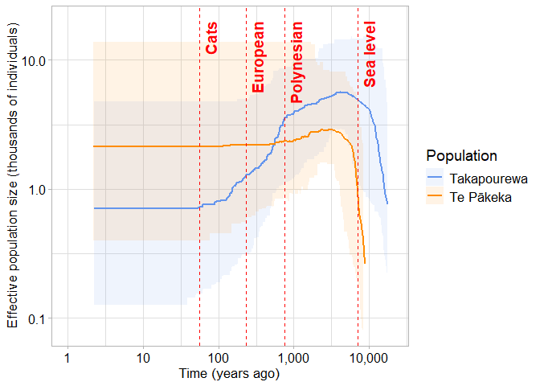

Stairway
================
Hadley Muller
2025-05-27

# Stairway Plot

### Data Import and Setup

``` r
# Clear workspace
rm(list = ls())

# Load required packages
library(ggplot2)
```

    ## Warning: package 'ggplot2' was built under R version 4.5.3

``` r
library(dplyr)
```

    ## Warning: package 'dplyr' was built under R version 4.5.3

    ## 
    ## Attaching package: 'dplyr'

    ## The following objects are masked from 'package:stats':
    ## 
    ##     filter, lag

    ## The following objects are masked from 'package:base':
    ## 
    ##     intersect, setdiff, setequal, union

``` r
library(scales)
```

\###Read STWP2 results

``` r
Takapourewa <- read.table("Folded_SFS Takapourewa.rand7.summary", header = T)

Takapourewa_scaled <- Takapourewa %>% mutate(
  yeark = year / 1000,
    Ne_medianK = Ne_median / 1000,
    Ne_2.5.K = Ne_2.5. / 1000,
    Ne_97.5.K  = Ne_97.5. / 1000) 

TePakeka <- read.table("Folded SFS Maud Island.rand9.summary", header = TRUE)

TePakeka_scaled <- TePakeka %>%
  mutate(
    yeark       = year / 1000,
    Ne_medianK  = Ne_median / 1000,
    Ne_2.5.K    = Ne_2.5. / 1000,
    Ne_97.5.K   = Ne_97.5. / 1000)

Together <- bind_rows(
  TePakeka_scaled %>% mutate(pop = "Te Pākeka"),
  Takapourewa_scaled %>% mutate(pop = "Takapourewa"))
```

# Plotting

Geom_ribbon is creating the 95% confidence interval;Geom_Step is
creating the Ne median line. I’ve borrowed the log scales limits from
Stairway Plots native plots.

``` r
Stairway <- ggplot(Together, aes(x = yeark)) +
  geom_ribbon(aes(ymin = Ne_2.5.K, ymax = Ne_97.5.K, fill = pop), alpha = 0.1) +
  geom_step(aes(y = Ne_medianK, colour = pop), linewidth = 0.8) +
  # I want to avoid scientific notation in this plot
  scale_x_log10(limits = c(0.001, 20),
                breaks = c(0.001, 0.01, 0.1, 1, 10),
                labels = c("1", "10", "100", "1,000", "10,000")) +
  scale_y_log10(limits = c(0.08, 20)) +
  labs(x = "Time (years ago)", y = "Effective population size (thousands of individuals)",
       colour = "Population", fill = "Population") +
    theme_light() +
    scale_colour_manual(values = c("cornflowerblue", "darkorange")) +
    scale_fill_manual(values = c("cornflowerblue", "darkorange"))
```

### Chronology of the Marlborough Sounds

I want to add vertical lines to represent the key events in the
chronology of the Marlborough Sounds:

stabilization of sea levels (7 Kya), arrival of Maori (0.75 Kya),
colonisation of Europeans (0.204 Kya and, the introduction of cats to
Takapourewa (0.056 Kya).

``` r
# create data frame
events <- data.frame(
  label = c("Sea level","Polynesian","European"," Cats"),
  x = c(7,0.75,0.23,0.056),
  y = c(20,20,20,20))


Stairway2 <- Stairway +
  geom_vline(data = events, aes(xintercept = x), colour = "red",
              linewidth = 0.5, linetype = "dashed") +
  geom_text(data = events, aes(x =x*1.4, y = y, label = label), 
            angle = 90, hjust = 1, fontface = "bold", colour = "red", size = 5) +
  coord_cartesian(clip = "off") +
  theme(
    axis.title.x = element_text(size = 13, colour = "black", face = "plain"),
    axis.title.y = element_text(size = 13, colour = "black", face = "plain"),
    axis.text.x  = element_text(size = 12, colour = "black"),
    axis.text.y  = element_text(size = 12, colour = "black"),
  legend.text = element_text(size=13),
  legend.title = element_text(size=14)
  ) 
  
              
Stairway2
```

    ## Warning: Removed 390 rows containing missing values or values outside the scale range
    ## (`geom_ribbon()`).

    ## Warning: Removed 2 rows containing missing values or values outside the scale range
    ## (`geom_step()`).

<!-- -->

``` r
ggsave(filename="Stairway.pdf", plot = Stairway2, dpi = 300, width = 11, height = 7, device = cairo_pdf)
```

    ## Warning: Removed 390 rows containing missing values or values outside the scale range
    ## (`geom_ribbon()`).
    ## Removed 2 rows containing missing values or values outside the scale range
    ## (`geom_step()`).
