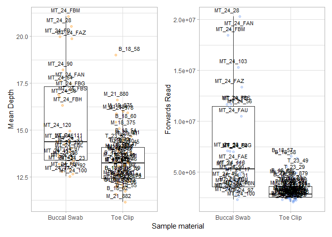

Swab.Tissue.Jitter
================
Hadley Muller
2025-04-07

# Sample comparison

I have completed SNP calling for the Hamilton’s Frog data, which
contains both tissues and, buccal swabs.

Because this is the first time anyone has utilised buccal swabbing on
*Leiopelma*, I’d like to produce box (or jitter) plots comparing
coverage depth and total sites.

## Data Import and Setup

``` r
# Clear workspace
rm(list = ls())

# Load required Packages
library(ggplot2)
```

    ## Warning: package 'ggplot2' was built under R version 4.4.3

``` r
library(dplyr)
```

    ## 
    ## Attaching package: 'dplyr'

    ## The following objects are masked from 'package:stats':
    ## 
    ##     filter, lag

    ## The following objects are masked from 'package:base':
    ## 
    ##     intersect, setdiff, setequal, union

``` r
library(patchwork)
```

    ## Warning: package 'patchwork' was built under R version 4.4.3

``` r
# Load data
Dep <- read.table("Depth.idepth", header = TRUE)

#Add sample information to the dataframe
Data <- Dep %>%
  mutate(Tissue = case_when(
    grepl("^B", INDV) ~ "Toe Clip",   
    grepl("^T", INDV) ~ "Toe Clip",    
    grepl("^M_", INDV) ~ "Toe Clip",
    grepl("^MT", INDV) ~ "Buccal Swab",   
    grepl("^G", INDV) ~ "Toe Clip"
    ))

#set seed
set.seed(7512)
```

\##Simple t-test

``` r
#Subset data
Dtoeclip <- (Data[Data$Tissue == "Toe Clip", "MEAN_DEPTH"])
Dswab <- (Data[Data$Tissue == "Buccal Swab", "MEAN_DEPTH"])

Ntoeclip <- (Data[Data$Tissue == "Toe Clip", "N_SITES"])
Nswab <- (Data[Data$Tissue == "Buccal Swab", "N_SITES"])

#Welch's t-test
t.test(Dtoeclip, Dswab, var.equal=FALSE)
```

    ## 
    ##  Welch Two Sample t-test
    ## 
    ## data:  Dtoeclip and Dswab
    ## t = -3.7698, df = 33.403, p-value = 0.000635
    ## alternative hypothesis: true difference in means is not equal to 0
    ## 95 percent confidence interval:
    ##  -3.1831964 -0.9523396
    ## sample estimates:
    ## mean of x mean of y 
    ##  13.45097  15.51874

``` r
t.test(Ntoeclip, Nswab, var.equal=FALSE)
```

    ## 
    ##  Welch Two Sample t-test
    ## 
    ## data:  Ntoeclip and Nswab
    ## t = -0.35383, df = 45.437, p-value = 0.7251
    ## alternative hypothesis: true difference in means is not equal to 0
    ## 95 percent confidence interval:
    ##  -540.6913  379.0671
    ## sample estimates:
    ## mean of x mean of y 
    ##  18266.85  18347.67

\##Create Jitterplots

``` r
#Total Sites
plot1 <- ggplot(Data, aes(x = Tissue, y = N_SITES)) +
  geom_boxplot(outlier.shape = NA) +
  geom_jitter(width = 0.15, colour = "cornflowerblue", alpha = 0.3) +
  theme_light() +
  labs(y= "Total sites", x = "Sample material")

#Coverage Depth
plot2 <- ggplot(Data, aes(x = Tissue, y = MEAN_DEPTH)) +
  geom_boxplot(outlier.shape = NA) +
  geom_jitter(width = 0.15, colour = "darkorange", alpha = 0.3) +
  theme_light() +
  labs(y= "Mean Depth", x = "Sample material")

(plots = wrap_plots(plot1,plot2)) +
  plot_layout(axis_titles = "collect")
```

<!-- -->

\#Investigating our coverage depth differences I’ve counted the number
of forwards reads from all our samples, and we can see if there is a
difference between swabs and tissue, especially for those outliers we
see in the current plots.

``` r
# Load data
Count <- read.table("forward_counts.txt", header = FALSE)

#Add sample information to the dataframe
Count <- Count %>%
  mutate(Tissue = case_when(
    grepl("^B", V1) ~ "Toe Clip",   
    grepl("^T", V1) ~ "Toe Clip",    
    grepl("^M_", V1) ~ "Toe Clip",
    grepl("^MT", V1) ~ "Buccal Swab",   
    grepl("^G", V1) ~ "Toe Clip"
    ))
```

\##Create Jitterplots

``` r
# Coverage depth

plot2 <- plot2 + geom_text(aes(label = INDV), position = position_jitter(width = 0.15, height = 0), size = 3, vjust = -1) 
# Forwards reads
plot3 <- ggplot(Count, aes(x = Tissue, y = V2)) +
  geom_boxplot(outlier.shape = NA) +
  geom_jitter(width = 0.15, colour = "cornflowerblue", alpha = 0.3) +
  geom_text(aes(label = V1), position = position_jitter(width = 0.15, height = 0), size = 3, vjust = -1) +
  theme_light() +
  labs(y= "Forwards Read", x = "Sample material")

(plots = wrap_plots(plot2,plot3)) +
  plot_layout(axis_titles = "collect")
```

<!-- -->
