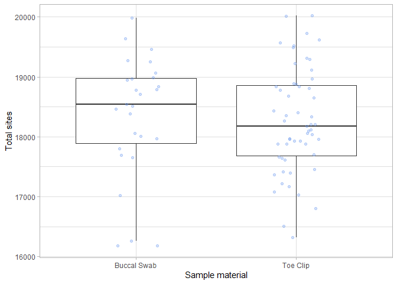
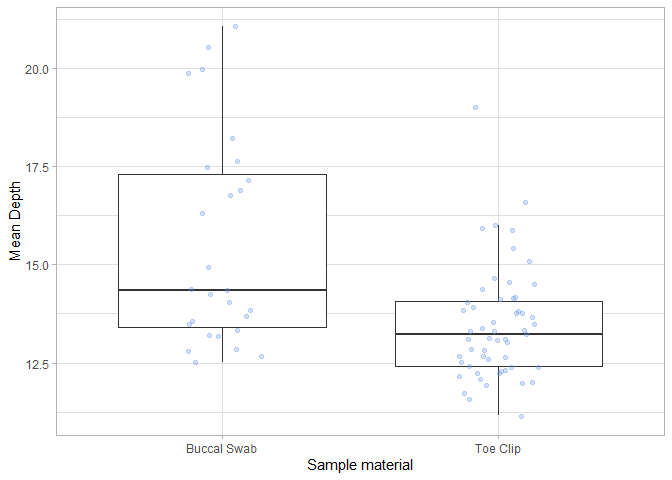

Swab.Tissue.Jitter
================

I have completed SNP calling for the Hamilton’s Frog data, which
contains both tissues and, buccal swabs.

Because this is the first time anyone has utilised buccal swabbing on
*Leiopelma*, I’d like to produce box (or jitter) plots comparing
coverage depth and total sites.

### Data Import and Setup

``` r
# Clear workspace
rm(list = ls())

# Load required Packages
library(ggplot2)
library(dplyr)
```

    ## 
    ## Attaching package: 'dplyr'

    ## The following objects are masked from 'package:stats':
    ## 
    ##     filter, lag

    ## The following objects are masked from 'package:base':
    ## 
    ##     intersect, setdiff, setequal, union

``` r
# Load data
Dep <- read.table("Depth.idepth", header = TRUE)

#Add sample information to the dataframe
Data <- Dep %>%
  mutate(Tissue = case_when(
    grepl("^B", INDV) ~ "Toe Clip",   
    grepl("^T", INDV) ~ "Toe Clip",    
    grepl("^M_", INDV) ~ "Toe Clip",
    grepl("^MT", INDV) ~ "Buccal Swab",   
    grepl("^G", INDV) ~ "Toe Clip"
    ))
```

\#Create Jitterplot

``` r
#Total Sites
ggplot(Data, aes(x = Tissue, y = N_SITES)) +
  geom_boxplot(outlier.shape = NA) +
  geom_jitter(width = 0.15, colour = "cornflowerblue", alpha = 0.3) +
  theme_light() +
  labs(y= "Total sites", x = "Sample material")
```

<!-- -->

``` r
#Coverage Depth
ggplot(Data, aes(x = Tissue, y = MEAN_DEPTH)) +
  geom_boxplot(outlier.shape = NA) +
  geom_jitter(width = 0.15, colour = "darkorange", alpha = 0.3) +
  theme_light() +
  labs(y= "Mean Depth", x = "Sample material")
```

<!-- -->
