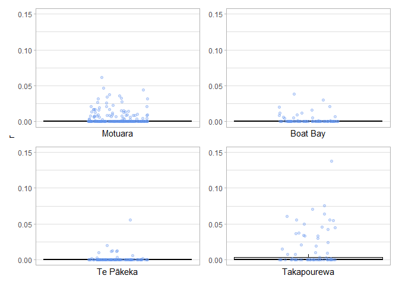

# Analysis Overview

I’ve got the .rds results saved and, I’d like to make a nice box plot to
visualise the results.

### Data Import and Setup

``` r
# Clear workspace
rm(list = ls())

#Load required packages
library(ggplot2)
library(patchwork)

# Load data
Takapourewa <- readRDS("Takapourewa_results.rds")
TePakeka <- readRDS("TePakeka_results.rds")
Motuara <- readRDS("Motuara_results.rds")
Boatbay <- readRDS("BoatBay_results.rds")
```

### Create Jitterplots

``` r
make_relatedness_plot <- function(data, pop_name) {
  ggplot(data$relatedness, aes(x = 1, y = trioml)) +
    geom_boxplot(outlier.shape = NA, fill = "grey90", colour = "black") +
    geom_jitter(width = 0.15, colour = "cornflowerblue", alpha = 0.3) +
    theme_light() +
    ylab(expression("r")) +
    xlab(pop_name) +
    scale_x_continuous(breaks = NULL) +
    scale_y_continuous(limits = c(0, 0.15), breaks = seq(0, 0.15, 0.05))
}
```

``` r
Mot   <- make_relatedness_plot(Motuara,   "Motuara")
Boat  <- make_relatedness_plot(Boatbay,   "Boat Bay")
TePa  <- make_relatedness_plot(TePakeka,  "Te Pākeka")
Taka  <- make_relatedness_plot(Takapourewa, "Takapourewa")

done <- (plots <- wrap_plots(Mot, Boat, TePa, Taka) +
  plot_layout(axis_titles = "collect"))

done
```

    ## Warning: Removed 147 rows containing missing values or values outside the scale range
    ## (`geom_point()`).

    ## Warning: Removed 92 rows containing missing values or values outside the scale range
    ## (`geom_point()`).

    ## Warning: Removed 78 rows containing missing values or values outside the scale range
    ## (`geom_point()`).

    ## Warning: Removed 37 rows containing missing values or values outside the scale range
    ## (`geom_point()`).

<!-- -->

``` r
ggsave(filename="done.png", plot = done, dpi = 300, width = 9, height = 8 )
```

    ## Warning: Removed 159 rows containing missing values or values outside the scale range
    ## (`geom_point()`).

    ## Warning: Removed 85 rows containing missing values or values outside the scale range
    ## (`geom_point()`).

    ## Warning: Removed 82 rows containing missing values or values outside the scale range
    ## (`geom_point()`).

    ## Warning: Removed 34 rows containing missing values or values outside the scale range
    ## (`geom_point()`).

