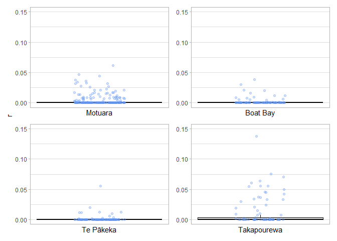

TrioML Plotting
================
Hadley Muller
2025-08-03

# Analysis Overview

I’ve got the .rds results saved and, I’d like to make a nice box plot to
visualise the results.

## Data Import and Setup

``` r
# Clear workspace
rm(list = ls())

#Load required packages
library(ggplot2)
library(patchwork)
library(dplyr)
```

    ## 
    ## Attaching package: 'dplyr'

    ## The following objects are masked from 'package:stats':
    ## 
    ##     filter, lag

    ## The following objects are masked from 'package:base':
    ## 
    ##     intersect, setdiff, setequal, union

``` r
# Load data
Takapourewa <- readRDS("Takapourewa_results.rds")
TePakeka <- readRDS("TePakeka_results.rds")
Motuara <- readRDS("Motuara_results.rds")
Boatbay <- readRDS("BoatBay_results.rds")
```

## Simple ANOVA

### Create a merged data frame

``` r
data_list <- list(Boatbay, Takapourewa, Motuara, TePakeka)

# we must assign names, otherwise R will just index by position ....
names(data_list) <- c("BB", "TK", "MT", "TP")

for (i in 1:length(data_list)) {
  df <- data_list[[i]]
  
  df <- df$relatedness %>% select(group, trioml)
  
  data_list[[i]] <- df
  assign(names(data_list)[i], df)
}

# merge into a dataframe, we use do.call() 
    # similar to sapply() but it outputs the result of the called function with       all arguments not a list etc. of the results per element.

TrioML <- do.call(rbind, data_list)
```

### ANOVA

``` r
m1 <- aov(trioml ~ group, data = TrioML)
summary(m1)
```

    ##              Df  Sum Sq   Mean Sq F value   Pr(>F)    
    ## group         3 0.00728 0.0024266   24.66 2.73e-15 ***
    ## Residuals   832 0.08188 0.0000984                     
    ## ---
    ## Signif. codes:  0 '***' 0.001 '**' 0.01 '*' 0.05 '.' 0.1 ' ' 1

``` r
TukeyHSD(m1)
```

    ##   Tukey multiple comparisons of means
    ##     95% family-wise confidence level
    ## 
    ## Fit: aov(formula = trioml ~ group, data = TrioML)
    ## 
    ## $group
    ##                    diff           lwr         upr     p adj
    ## MAMA-BBBB -0.0002610526 -0.0028811338 0.002359029 0.9940823
    ## MTMT-BBBB  0.0016371315 -0.0006629585 0.003937221 0.2588697
    ## TATA-BBBB  0.0092627318  0.0061573421 0.012368122 0.0000000
    ## MTMT-MAMA  0.0018981841 -0.0004019058 0.004198274 0.1461715
    ## TATA-MAMA  0.0095237845  0.0064183948 0.012629174 0.0000000
    ## TATA-MTMT  0.0076256003  0.0047849959 0.010466205 0.0000000

## Create Jitterplots

``` r
make_relatedness_plot <- function(data, pop_name) {
  ggplot(data$relatedness, aes(x = 1, y = trioml)) +
    geom_boxplot(outlier.shape = NA, fill = "grey90", colour = "black") +
    geom_jitter(width = 0.15, colour = "cornflowerblue", alpha = 0.3) +
    theme_light() +
    ylab(expression("r")) +
    xlab(pop_name) +
    scale_x_continuous(breaks = NULL) +
    scale_y_continuous(limits = c(0, 0.15), breaks = seq(0, 0.15, 0.05))
}
```

``` r
Mot   <- make_relatedness_plot(Motuara,   "Motuara")
Boat  <- make_relatedness_plot(Boatbay,   "Boat Bay")
TePa  <- make_relatedness_plot(TePakeka,  "Te Pākeka")
Taka  <- make_relatedness_plot(Takapourewa, "Takapourewa")

done <- (plots <- wrap_plots(Mot, Boat, TePa, Taka) +
  plot_layout(axis_titles = "collect"))

done
```

    ## Warning: Removed 141 rows containing missing values or values outside the scale range
    ## (`geom_point()`).

    ## Warning: Removed 84 rows containing missing values or values outside the scale range
    ## (`geom_point()`).

    ## Warning: Removed 76 rows containing missing values or values outside the scale range
    ## (`geom_point()`).

    ## Warning: Removed 37 rows containing missing values or values outside the scale range
    ## (`geom_point()`).

<!-- -->

``` r
ggsave(filename="done.png", plot = done, dpi = 300, width = 9, height = 8 )
```

    ## Warning: Removed 143 rows containing missing values or values outside the scale range
    ## (`geom_point()`).

    ## Warning: Removed 77 rows containing missing values or values outside the scale range
    ## (`geom_point()`).

    ## Warning: Removed 85 rows containing missing values or values outside the scale range
    ## (`geom_point()`).

    ## Warning: Removed 33 rows containing missing values or values outside the scale range
    ## (`geom_point()`).
