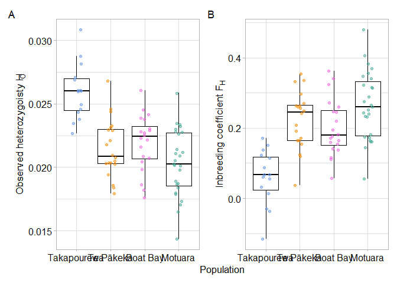

Genetic Diversity and Inbreeding
================
Hadley Muller
2025-04-30

# Plotting

## Data Import and Setup

``` r
# Clear workspace
rm(list = ls())

# Load required Packages
library(ggplot2)
```

    ## Warning: package 'ggplot2' was built under R version 4.5.3

``` r
library(dplyr)
```

    ## Warning: package 'dplyr' was built under R version 4.5.3

    ## 
    ## Attaching package: 'dplyr'

    ## The following objects are masked from 'package:stats':
    ## 
    ##     filter, lag

    ## The following objects are masked from 'package:base':
    ## 
    ##     intersect, setdiff, setequal, union

``` r
library(patchwork)
```

    ## Warning: package 'patchwork' was built under R version 4.5.3

``` r
# Load data
Het <- read.table("Het_Under065.het", header = TRUE)

#Add sample information to the dataframe
Het <- Het %>%
  mutate(Pop = case_when(
    grepl("^B", INDV) ~ "Boat Bay",   
    grepl("^T", INDV) ~ "Takapourewa",    
    grepl("^M_", INDV) ~ "Te Pākeka",
    grepl("^MT", INDV) ~ "Motuara",   
    grepl("^G", INDV) ~ "Te Pākeka"
    ))

#Calculate the proportion of heterozygotes
Het$Prop.Het <- (Het$N_SITES - Het$O.HOM.) / Het$N_SITES

#Set factor levels, in line with other visualisations
Het$Pop <- factor(Het$Pop, levels = c("Takapourewa", "Te Pākeka", "Boat Bay", "Motuara" ))
```

## Simple ANOVA

First for heterozygosity.

``` r
m1 <- aov(Prop.Het ~ Pop, data = Het)
summary(m1)
```

    ##             Df    Sum Sq   Mean Sq F value   Pr(>F)    
    ## Pop          3 0.0003201 0.0001067   19.05 2.29e-09 ***
    ## Residuals   78 0.0004368 0.0000056                     
    ## ---
    ## Signif. codes:  0 '***' 0.001 '**' 0.01 '*' 0.05 '.' 0.1 ' ' 1

``` r
TukeyHSD(m1)
```

    ##   Tukey multiple comparisons of means
    ##     95% family-wise confidence level
    ## 
    ## Fit: aov(formula = Prop.Het ~ Pop, data = Het)
    ## 
    ## $Pop
    ##                                diff          lwr           upr     p adj
    ## Te Pākeka-Takapourewa -0.0044936146 -0.006615685 -0.0023715445 0.0000022
    ## Boat Bay-Takapourewa  -0.0040328403 -0.006154910 -0.0019107701 0.0000211
    ## Motuara-Takapourewa   -0.0056718359 -0.007672543 -0.0036711290 0.0000000
    ## Boat Bay-Te Pākeka     0.0004607744 -0.001503881  0.0024254295 0.9267817
    ## Motuara-Te Pākeka     -0.0011782213 -0.003011120  0.0006546771 0.3371188
    ## Motuara-Boat Bay      -0.0016389956 -0.003471894  0.0001939027 0.0961908

And for inbreeding

``` r
m2 <- aov(F ~ Pop, data = Het)
summary(m2)
```

    ##             Df Sum Sq Mean Sq F value   Pr(>F)    
    ## Pop          3 0.4180 0.13933   18.87 2.68e-09 ***
    ## Residuals   78 0.5758 0.00738                     
    ## ---
    ## Signif. codes:  0 '***' 0.001 '**' 0.01 '*' 0.05 '.' 0.1 ' ' 1

``` r
TukeyHSD(m2)
```

    ##   Tukey multiple comparisons of means
    ##     95% family-wise confidence level
    ## 
    ## Fit: aov(formula = F ~ Pop, data = Het)
    ## 
    ## $Pop
    ##                              diff          lwr        upr     p adj
    ## Te Pākeka-Takapourewa  0.16317900  0.086132552 0.24022545 0.0000022
    ## Boat Bay-Takapourewa   0.14201900  0.064972552 0.21906545 0.0000377
    ## Motuara-Takapourewa    0.20482281  0.132182727 0.27746290 0.0000000
    ## Boat Bay-Te Pākeka    -0.02116000 -0.092491151 0.05017115 0.8638402
    ## Motuara-Te Pākeka      0.04164381 -0.024903614 0.10819124 0.3609868
    ## Motuara-Boat Bay       0.06280381 -0.003743614 0.12935124 0.0714244

## Descriptive Statistics

I want overall, and by populations

``` r
mean(Het$Prop.Het)
```

    ## [1] 0.02203212

``` r
mean(Het$F)
```

    ## [1] 0.2016422

``` r
sd(Het$Prop.Het)
```

    ## [1] 0.003056993

``` r
sd(Het$F)
```

    ## [1] 0.1107676

``` r
group_mean <- Het %>%
  group_by(Pop) %>%
  summarise_at(vars(Prop.Het, F),
               list(mean = mean))

print(group_mean)
```

    ## # A tibble: 4 × 3
    ##   Pop         Prop.Het_mean F_mean
    ##   <fct>               <dbl>  <dbl>
    ## 1 Takapourewa        0.0260 0.0598
    ## 2 Te Pākeka          0.0215 0.223 
    ## 3 Boat Bay           0.0219 0.202 
    ## 4 Motuara            0.0203 0.265

## Create Jitterplots

``` r
#Total Sites
A <- ggplot(Het, aes(x = Pop, y = Prop.Het, colour = Pop)) +
  geom_boxplot(outlier.shape = NA, colour = "black") +
  geom_jitter(width = 0.15, alpha = 0.5) +
  theme_light() +
  ylab(expression("Observed heterozygoisty H"  [O])) +
  xlab("Population") +
   scale_colour_manual(values = c("cornflowerblue", "darkorange","#F763E0", "#44AA99")) +
    theme(
    axis.title.x = element_text(size = 13, colour = "black", face = "plain"),
    axis.title.y = element_text(size = 13, colour = "black", face = "plain"),
    axis.text.x  = element_text(size = 12, colour = "black"),
    axis.text.y  = element_text(size = 12, colour = "black")
  ) +
  theme(legend.position="none")


#Inbreeding F(is)
B <- ggplot(Het, aes(x = Pop, y = F, colour = Pop)) +
  geom_boxplot(outlier.shape = NA, colour = "black") +
  geom_jitter(width = 0.15, alpha = 0.5) +
  theme_light() +
  ylab(expression("Inbreeding coefficient F" [H])) +
  xlab("Population") +
  scale_colour_manual(values = c("cornflowerblue", "darkorange","#F763E0", "#44AA99")) +
  theme(
    axis.title.x = element_text(size = 13, colour = "black", face = "plain"),
    axis.title.y = element_text(size = 13, colour = "black", face = "plain"),
    axis.text.x  = element_text(size = 12, colour = "black"),
    axis.text.y  = element_text(size = 12, colour = "black")
  ) +
  theme(legend.position="none")
```

``` r
Together <- (plots = wrap_plots(A,B)) +
  plot_layout(axis_titles = "collect") + plot_annotation(tag_levels = "A")

Together
```

<!-- -->

``` r
ggsave(filename="Figure 3.pdf", plot = Together, dpi = 300, width = 11, height = 7, device = cairo_pdf)
```
